# Group Dependencies

## Dependency Relationships

### Group 1: Stdlib Module Name Resolution & Runtime
- **Blocks:** Nearly everything. Groups 3c, 4, 5, 8, 9, 10, and most ungrouped issues need stdlib calls for test output verification.
- **Blocked by:** Group 3a (boolean exhaustiveness) -- if-then-else desugars to boolean match, so many Group 1 tests that use if-then-else silently depend on boolean exhaustiveness being fixed. Group 4 (multi-arg calls) -- many stdlib functions take 2+ args in tupled syntax.
- **Internal ordering:** Name resolution must come before runtime codegen. Builtin registration gaps can be fixed in parallel with either.

### Group 2: User-Defined Type Declaration Processing
- **Blocks:** Group 9 (pattern matching needs user variant constructors for or-pattern tests). Partially blocks Group 3c (while loop tests that use match on user types).
- **Blocked by:** Nothing directly, but tests that verify this work also need Group 1 for output.
- **Internal ordering:** Variant constructor registration should come first (highest impact), then type alias transparency, then generic type resolution, then validation.

### Group 3a: Boolean Exhaustiveness (sub-group of Group 3)
- **Blocks:** Group 1 indirectly (if-then-else is pervasive). Group 3c (while loop desugaring).
- **Blocked by:** Nothing. This is an isolated fix.

### Group 3b: Wildcard Pattern in Let-Bindings (sub-group of Group 3)
- **Blocks:** Group 3c (while loop desugaring uses wildcard let).
- **Blocked by:** Nothing. This is an isolated fix.

### Group 3c: Mutable Reference Specific Issues
- **Blocks:** Nothing directly (while loops and refs don't block other features).
- **Blocked by:** Groups 1, 3a, 3b, 6. Tests need stdlib output (Group 1), boolean exhaustiveness (3a), wildcard let (3b), and zero-arg lambda (Group 6) to be fixed first. Also requires **design decision** on prefix vs postfix `!`.
- **Internal ordering:** Prefix `!` disambiguation → top-level expressions → nested `let mut` → codegen double-wrapping → block expression bare statements.

### Group 4: Multi-Argument Call Desugaring
- **Blocks:** Group 1 partially -- many stdlib function tests use multi-arg syntax `f(a, b)` which fails even after name resolution is fixed.
- **Blocked by:** Nothing. This is an independent desugarer change.
- **Internal ordering:** Single change in the desugarer.

### Group 5: Tuple Type System
- **Blocks:** Nothing (tuples are self-contained).
- **Blocked by:** Group 1 (tests need stdlib for output).
- **Internal ordering:** Type inference → unification → pattern matching → exhaustiveness.

### Group 6: Zero-Arg Lambda & Empty Block
- **Blocks:** Group 3c partially (the makeCounter pattern uses `() => {...}`). Also blocks some short-circuit tests in Group 1's scope.
- **Blocked by:** Nothing. These are self-contained desugarer fixes.

### Group 7: Multi-File Compilation Pipeline
- **Blocks:** Nothing outside of section 08 modules.
- **Blocked by:** Group 1 partially (stdlib functions used in module tests). The single-quote test fixture fix is independent.
- **Notes:** This is the largest single work item but only affects 14 tests in section 08. Much infrastructure already exists.

### Group 8: Float Arithmetic Operators
- **Blocks:** Nothing directly. However, some tests counted under Group 1 also need float operator support to actually pass.
- **Blocked by:** Group 1 (tests need stdlib for output).
- **Internal ordering:** Follow the existing Divide operator pattern for all other operators.

### Group 9: Pattern Matching Completeness
- **Blocks:** Nothing.
- **Blocked by:** Group 2 (or-pattern with variant constructors needs user types registered). Nullary constructor crash (ungrouped item 6) may affect some edge cases.
- **Internal ordering:** Or-pattern validation → nested or-pattern expansion → guard-aware exhaustiveness → unreachable detection.

### Group 10: JavaScript Interop Completeness
- **Blocks:** Nothing.
- **Blocked by:** Group 1 (tests need stdlib for output). Try/catch depends on multi-line unsafe blocks.
- **Internal ordering:** Multi-line unsafe → unsafe enforcement → try/catch.

### Ungrouped Issues
- **Explicit type parameters:** Independent of all groups.
- **String literal unions:** Independent of all groups.
- **Lambda destructuring:** Independent of all groups.
- **Division-by-zero checks:** Fully independent -- no prerequisites at all.
- **Record width subtyping:** Should be addressed alongside Group 2 (type declaration validation).
- **Nullary constructor crash:** Independent, but may affect Group 9 edge cases.
- **Test fixture type redefinition:** Independent test authoring fix.

## Dependency Graph

```mermaid
graph TD
    G3a[Sub-Group 3a: Boolean<br/>Exhaustiveness - PREREQUISITE]
    G3b[Sub-Group 3b: Wildcard<br/>in Let-Bindings - PREREQUISITE]
    G6[Group 6: Zero-Arg Lambda<br/>& Empty Block ~6 tests]
    G4[Group 4: Multi-Arg Call<br/>Desugaring ~5 tests]
    G1[Group 1: Stdlib Name Resolution<br/>& Runtime ~150 tests]
    G2[Group 2: User-Defined Type<br/>Declarations ~20 tests]
    G3c[Sub-Group 3c: Mutable Ref<br/>Issues ~15 tests]
    G5[Group 5: Tuple Type<br/>System ~7 tests]
    G7[Group 7: Multi-File<br/>Pipeline ~14 tests]
    G8[Group 8: Float Arithmetic<br/>Operators ~7 tests]
    G9[Group 9: Pattern Matching<br/>Completeness ~4 tests]
    G10[Group 10: JS Interop<br/>Completeness ~3 tests]
    U1[Explicit Type Params<br/>2 tests]
    U2[String Literal Unions<br/>1 test]
    U3[Lambda Destructuring<br/>1 test]
    U4[Div-by-Zero Checks<br/>2 tests]
    U5[Record Subtyping<br/>Direction]
    U6[Nullary Constructor<br/>Crash ~3 tests]
    U7[Test Fixture Type<br/>Redefinitions ~19 tests]

    %% Phase 1 prerequisites feed into Phase 2
    G3a -->|if-then-else needs<br/>bool exhaustiveness| G1
    G4 -->|stdlib tests use<br/>multi-arg calls| G1

    %% Group 1 blocks downstream test verification
    G1 -->|tests need output| G3c
    G1 -->|tests need output| G5
    G1 -->|tests need output| G8
    G1 -->|tests need output| G10
    G1 -->|tests need output| G7
    G1 -->|tests need output| U4

    %% Other dependencies
    G6 -->|zero-arg lambda| G3c
    G3a -->|bool match| G3c
    G3b -->|wildcard let| G3c
    G2 -->|constructors needed| G9
    U6 -.->|edge cases| G9

    %% Float operators overlap with Group 1 tests
    G8 -.->|some Group 1 tests<br/>also need float ops| G1

    %% Style
    classDef prereq fill:#c3aed6,stroke:#333,color:#000
    classDef critical fill:#ff6b6b,stroke:#333,color:#000
    classDef high fill:#ffa94d,stroke:#333,color:#000
    classDef medium fill:#ffd43b,stroke:#333,color:#000
    classDef low fill:#69db7c,stroke:#333,color:#000
    classDef independent fill:#74c0fc,stroke:#333,color:#000

    class G3a,G3b,G6,G4 prereq
    class G1 critical
    class G2,G3c high
    class G8 medium
    class G5,G7,G9,G10 low
    class U1,U2,U3,U4,U5,U6,U7 independent
```

### Key Observations

1. **Group 3a (boolean exhaustiveness) and Group 4 (multi-arg calls) are hidden prerequisites for Group 1.** If-then-else desugars to boolean match, and many stdlib tests use `f(a, b)` calling convention. Both must be fixed alongside or before Group 1 for maximum test unblocking.

2. **Groups 3a, 3b, 4, and 6 are all small, independent prerequisites** that should be done first. They have no dependencies and enable downstream work.

3. **Group 1 is the critical path bottleneck.** After the prerequisites are cleared, it is the single highest-impact work item.

4. **Group 2 is independently important** for a usable language but has fewer downstream dependents than Group 1.

5. **Test count caveats:** The "~150 tests" figure for Group 1 represents tests where stdlib resolution is **at least one** blocker. Many tests have multiple overlapping blockers. The actual number of tests that will pass after fixing only Group 1 is lower. Similarly, downstream groups' test counts include overlap.

6. **Group 7 (modules) is large but isolated.** It only affects 14 tests and can be deferred without blocking other work.

7. **Two design decisions must be made** before implementation: prefix vs postfix `!` for dereference (Group 3c), and confirmation of `f(a,b)` → `f(a)(b)` desugaring (Group 4, spec is clear on this).
