# Group Dependencies

This document maps the dependencies between the 12 groups of related spec validation failures.

## Dependency Summary

| Group | Name | Blocks | Blocked By |
|-------|------|--------|------------|
| G1 | Stdlib Module Resolution | G11 (partially) | - |
| G2 | User-Defined Type Declarations | - | - |
| G3 | Multi-Arg Call Desugaring | - | - |
| G4 | Bool Exhaustiveness | - | - |
| G5 | Nullary Constructor Types | - | - |
| G6 | Prefix `!` Disambiguation | G11 | - |
| G7 | Zero-Param Lambdas / Empty Blocks | - | - |
| G8 | Top-Level Expressions | - | - |
| G9 | Tuple Type Inference | - | - |
| G10 | Module System Integration | - | - |
| G11 | Mutable Ref Codegen | - | G1, G6 |
| G12 | Miscellaneous Standalone | - | varies |

## Detailed Dependencies

### G1: Stdlib Module Resolution
- **Blocks:** G11 (mutable ref codegen issues can't be tested until output works)
- **Blocks:** All runtime output testing across sections (test infrastructure dependency)
- **No hard blockers**, but should be designed with G10 (module system) in mind so that `String.fromInt` works consistently whether `String` is a builtin module or an imported module.

### G2: User-Defined Type Declarations
- **Independent** of other groups (built-in variants already work via builtins.ts)
- **Synergy with G5:** Fixing nullary constructor representation (G5) first would simplify how user-defined nullary constructors are registered

### G3: Multi-Arg Call Desugaring
- **Fully independent** - a desugarer-only change
- **Testing depends on G1** - many affected tests also need stdlib resolution to verify output

### G4: Bool Exhaustiveness
- **Fully independent** - a typechecker-only change in `patterns.ts`
- **Unblocks if-then-else** which is used pervasively, but if-then-else tests also depend on G1 for output

### G5: Nullary Constructor Types
- **Independent** - can be fixed in `builtins.ts` and `format.ts`
- **Helps G2:** If nullary constructors are represented correctly, user-defined type processing (G2) is simpler

### G6: Prefix `!` Disambiguation
- **Blocks G11:** Mutable ref codegen issues can't be observed until deref syntax works
- **Independent of G1** but tests also need G1 for output verification

### G7: Zero-Param Lambdas / Empty Blocks
- **Fully independent** - two small desugarer fixes

### G8: Top-Level Expressions
- **Partially dependent on G4:** While loops at top level also need Bool exhaustiveness for the condition
- **Independent otherwise** - parser change to allow expression statements

### G9: Tuple Type Inference
- **Fully independent** - self-contained typechecker feature

### G10: Module System Integration
- **Fully independent** - connects existing but unwired infrastructure
- **Design alignment with G1:** Both involve resolving qualified names; the solution for G1 should not conflict with how modules expose their exports

### G11: Mutable Ref Codegen
- **Blocked by G1** (can't test output without stdlib resolution)
- **Blocked by G6** (can't test deref without prefix `!` working)
- **Partially blocked by G8** (some tests need top-level `:=` statements)

### G12: Miscellaneous Standalone
- **12a (div-by-zero):** Independent
- **12b (string literal unions):** Independent
- **12c (lambda type params):** Independent
- **12d (lambda destructuring):** Independent
- **12e (record width subtyping):** Independent
- **12f (unsafe enforcement):** Independent
- **12g (test single quotes):** Subset of G10

## Dependency Graph

```mermaid
graph TD
    G1["G1: Stdlib Module Resolution<br/>(~120 tests, Medium)"]
    G2["G2: User-Defined Type Declarations<br/>(~15 tests, Large)"]
    G3["G3: Multi-Arg Call Desugaring<br/>(~8 tests, Small)"]
    G4["G4: Bool Exhaustiveness<br/>(~8 tests, Small)"]
    G5["G5: Nullary Constructor Types<br/>(~4 tests, Simple)"]
    G6["G6: Prefix ! Disambiguation<br/>(~6 tests, Medium)"]
    G7["G7: Zero-Param Lambdas / Empty Blocks<br/>(~4 tests, Small)"]
    G8["G8: Top-Level Expressions<br/>(~8 tests, Medium)"]
    G9["G9: Tuple Type Inference<br/>(~6 tests, Large)"]
    G10["G10: Module System Integration<br/>(9 tests, Large)"]
    G11["G11: Mutable Ref Codegen<br/>(~2 tests, Small)"]
    G12a["G12a: Int Div-by-Zero Panic<br/>(1 test, Small)"]
    G12b["G12b: String Literal Unions<br/>(1 test, Medium)"]
    G12c["G12c: Lambda Type Params<br/>(1 test, Medium)"]
    G12d["G12d: Lambda Destructuring<br/>(1 test, Medium)"]
    G12e["G12e: Record Width Subtyping<br/>(1 test, Small)"]
    G12f["G12f: Unsafe Enforcement<br/>(1 test, Medium)"]

    G1 -->|"tests need output"| G11
    G6 -->|"deref syntax needed"| G11
    G8 -->|"top-level := needed"| G11
    G5 -.->|"simplifies"| G2
    G4 -.->|"while condition"| G8
    G1 -.->|"design alignment"| G10

    style G1 fill:#ff6b6b,stroke:#333,color:#000
    style G2 fill:#ffa07a,stroke:#333,color:#000
    style G3 fill:#98fb98,stroke:#333,color:#000
    style G4 fill:#98fb98,stroke:#333,color:#000
    style G5 fill:#90ee90,stroke:#333,color:#000
    style G7 fill:#90ee90,stroke:#333,color:#000
    style G6 fill:#ffa07a,stroke:#333,color:#000
    style G8 fill:#ffa07a,stroke:#333,color:#000
    style G9 fill:#ffa07a,stroke:#333,color:#000
    style G10 fill:#ff6b6b,stroke:#333,color:#000
    style G11 fill:#98fb98,stroke:#333,color:#000
```

**Legend:**
- Red: High impact, blocks many tests
- Orange: Medium impact or medium complexity
- Green: Small/simple fixes
- Solid arrows: Hard dependency (must be done first)
- Dashed arrows: Soft dependency (helps or simplifies, but not strictly required)

## Key Observations

1. **G1 (Stdlib Module Resolution) is the critical path.** It blocks test verification for ~120 tests across all sections. Most other groups' fixes cannot be validated without G1 working.

2. **G11 (Mutable Ref Codegen) has the most upstream dependencies** - it needs G1, G6, and partially G8 before its fixes can be tested.

3. **Most groups are independent of each other.** G2, G3, G4, G5, G7, G9, G10, and most of G12 can be worked on in parallel.

4. **G1 and G10 share a design concern.** Both involve resolving qualified names (`Module.function`). The solution for G1 should be designed to be compatible with how modules will expose their exports in G10.
